# Задание 1. Анализ и планирование

### 1. Описание функциональности монолитного приложения

**Управление отоплением:**

- Пользователи могут удалённо включать/выключать отопление в своих домах

**Мониторинг температуры:**

- Пользователи могут просматривать текущую температуру в своих домах через веб-интерфейс
- Система получает данные о температуре с датчиков, установленных в домах

### 2. Анализ архитектуры монолитного приложения

- **Язык программирования**: Go
- **База данных**: PostgreSQL
- **Архитектура**: Монолитная, все компоненты системы (обработка запросов, бизнес-логика, работа с данными) находятся в рамках одного приложения.
- **Взаимодействие**: Синхронное, по REST'у, запросы обрабатываются последовательно.

### 3. Определение доменов и границы контекстов

- **Домен**: управление устройствами
  - поддомен администрирования сенсоров
    - контекст: добавление устройства
    - контекст: удаление устройства
  - поддомен: обновление данных устройств
    - контекст: обновление значения сенсора
    - контекст: обновление информации о сенсоре
- **Домен**: просмотр температуры
- **Домен**: управление отоплением

### **4. Проблемы монолитного решения**

- Пользователи не могут сами регистрировать свои устройства
- Добавление нового функционала затруднено, так как при тестировании придется тестировать весь прошлый функционал
- Масштабируемость ограничена, нельзя масштабировать по компонентам
- Развертывание требует остановки всего приложения

### 5. Визуализация контекста системы — диаграмма С4

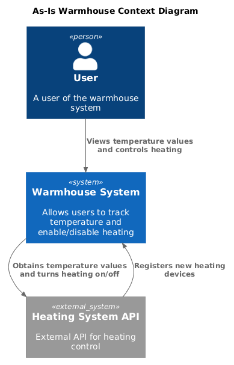

# Задание 2. Проектирование микросервисной архитектуры

**Диаграмма контейнеров (Containers)**

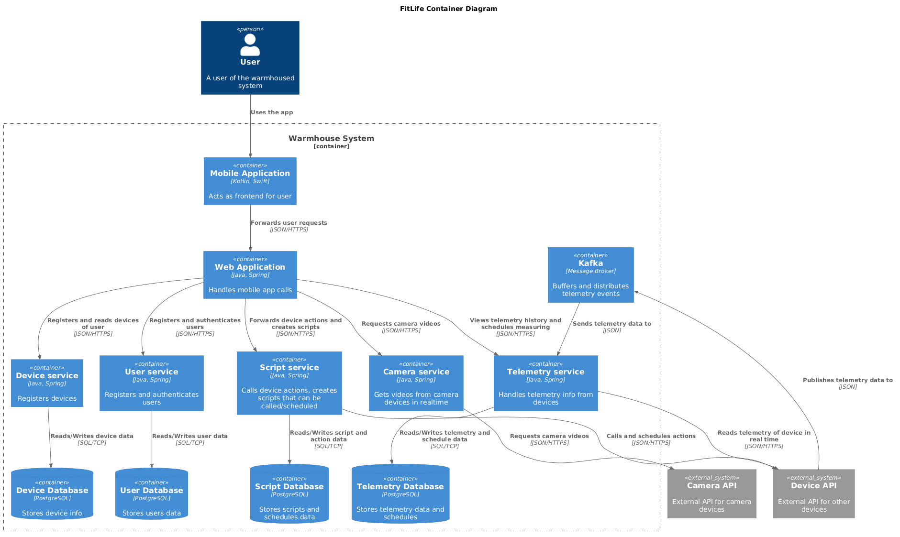

**Диаграмма компонентов (Components)**

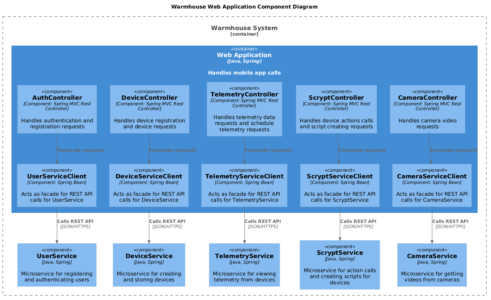

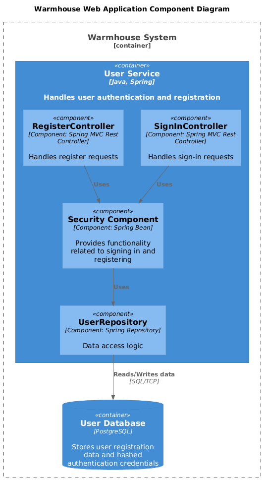

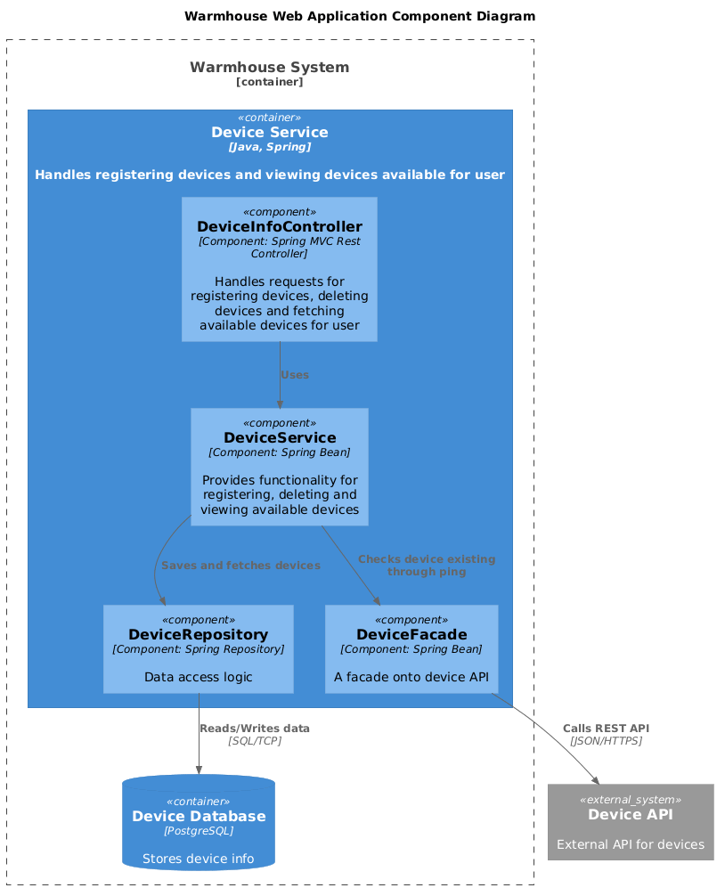

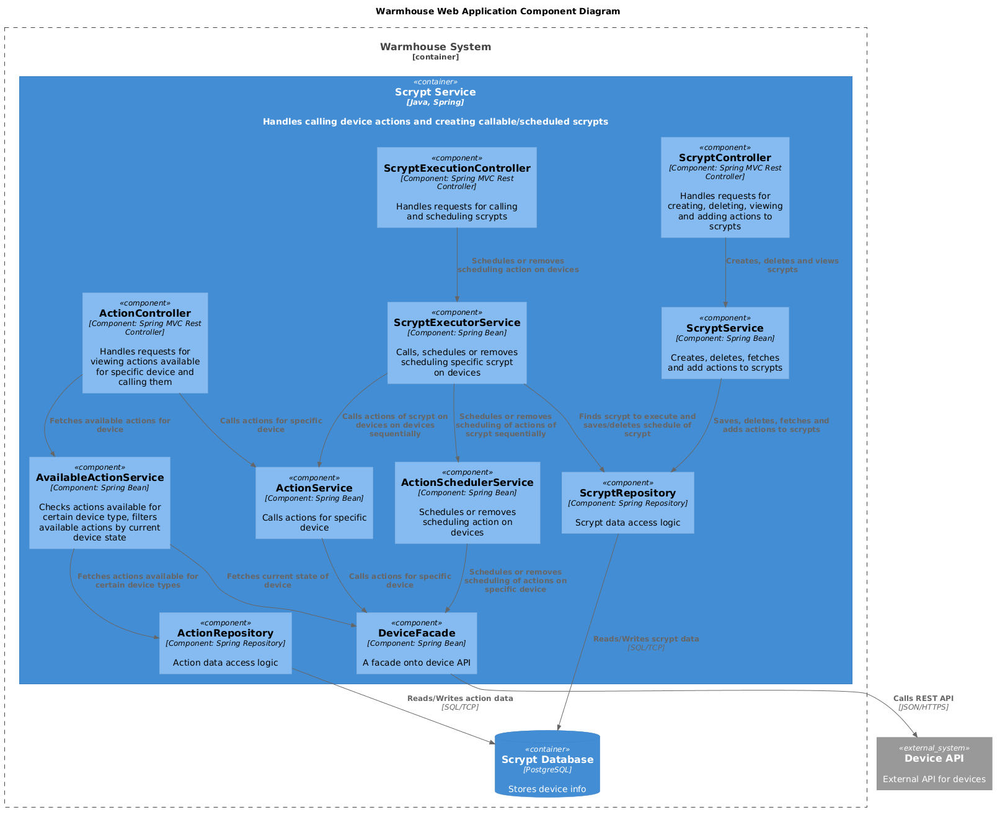

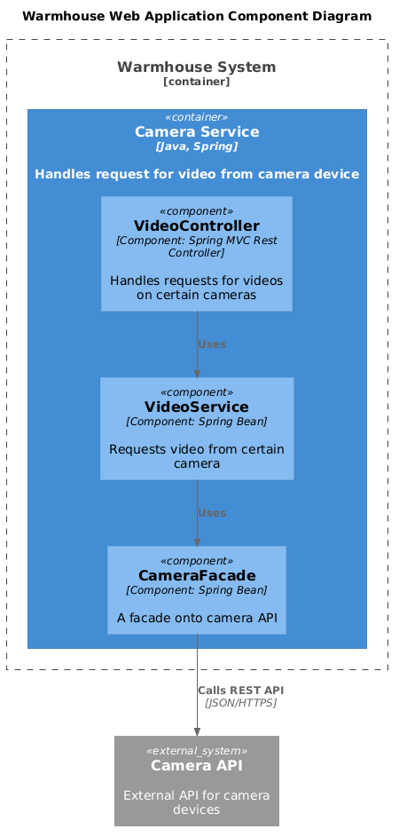

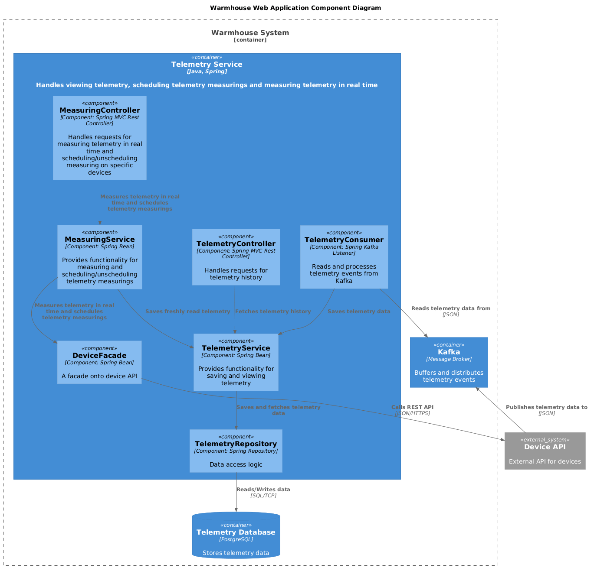

**Диаграмма кода (Code)**

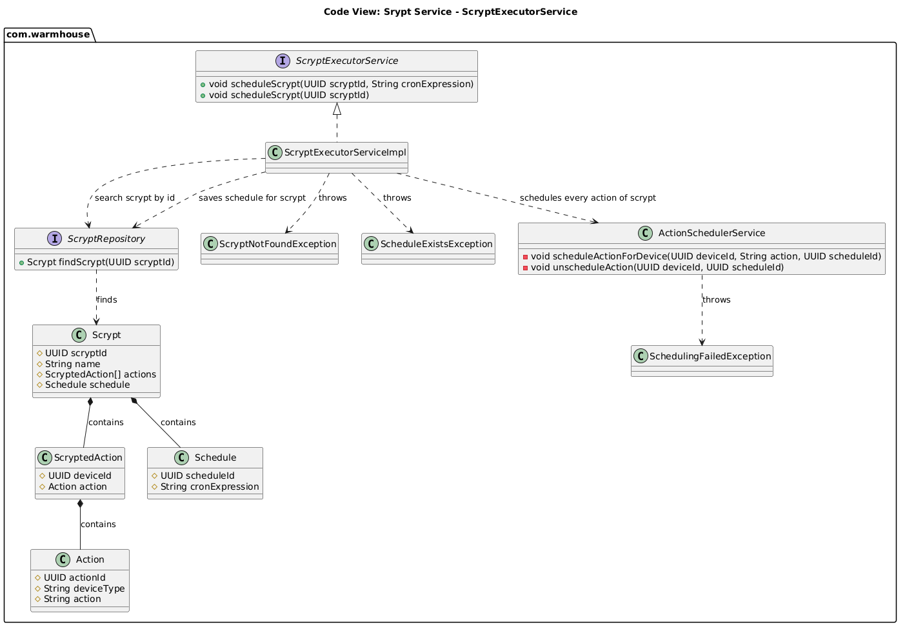

# Задание 3. Разработка ER-диаграммы

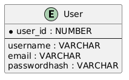

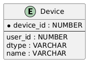

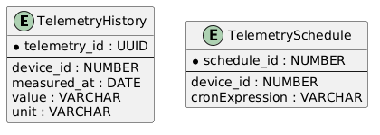

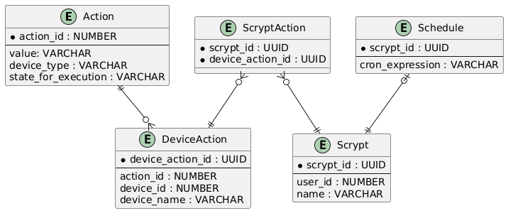

Связи между всеми БД:

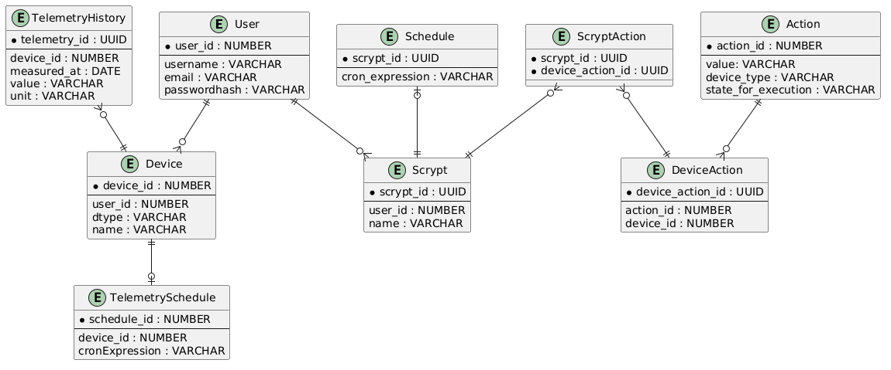

# Задание 4. Создание и документирование API

### 1. Тип API

Для взаимодействия между мобильным приложением и бэкендом будет использоваться REST API по HTTPS, как и для взаимодействия между основным бэкенд приложением и микросервисами, так как для таких запросов важен немедленный ответ для отображения в приложении.
Для публикации изменений телеметрии в БД выбрано асинхронное взаимодействие через брокер сообщений, так как устройствам не нужно получать ответ, и это позволяет не опрашивать устройства через микросервис. Также сохранена возможность запрашивать телеметрию в реальном времени через REST API.

### 2. Документация API

[АПИ бэкенда для мобильного приложения](openapi/webapp-api.yaml)

[АПИ user-service](openapi/user-service-api.yaml)

[АПИ device-service](openapi/device-service-api.yaml)

[АПИ telemetry-service](openapi/telemetry-service-api.yaml)

[Асинхронное АПИ telemetry-service](openapi/telemetry-service-async-api.yaml)

[АПИ scrypt-service](openapi/scrypt-service-api.yaml)

[АПИ camera-service](openapi/camera-service-api.yaml)

# Задание 5. Работа с docker и docker-compose

[docker-compose.yml](apps/docker-compose.yml)

